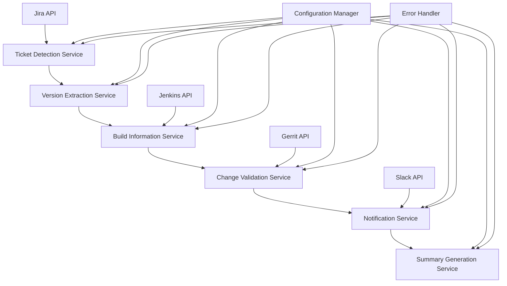

# Design Document - Release Signoff Automation

## Overview

The Release Signoff Automation system is designed as an event-driven workflow that automatically processes release tickets through validation stages. The system integrates with Jira for ticket management, Jenkins for build information, Gerrit for code change tracking, and Slack for notifications. The architecture follows a modular approach with clear separation of concerns between ticket detection, version extraction, validation, and notification components.

## Architecture

The system follows a pipeline architecture with the following main components:



### Core Components

1. **Ticket Detection Service**: Monitors Jira for new release tickets in ACCEPTED state
2. **Version Extraction Service**: Extracts version information from tickets and historical data
3. **Build Information Service**: Retrieves build details and version information from Jenkins
4. **Change Validation Service**: Validates commits and associated Jira tickets from Gerrit
5. **Notification Service**: Sends Slack notifications for validation failures
6. **Summary Generation Service**: Compiles and updates release tickets with validation results

## Components and Interfaces

### Ticket Detection Service

**Purpose**: Automatically detect new release signoff tickets and initiate processing

**Interface**:
```python
class TicketDetectionService:
    def detect_new_release_tickets(self) -> List[ReleaseTicket]
    def extract_version_from_ticket(self, ticket: ReleaseTicket) -> str
    def validate_ticket_format(self, ticket: ReleaseTicket) -> bool
```

**Dependencies**: Jira API, Configuration Manager

### Version Extraction Service

**Purpose**: Extract and manage version information from various sources

**Interface**:
```python
class VersionExtractionService:
    def get_previous_release_versions(self, current_version: str) -> VersionInfo
    def extract_versions_from_build(self, build_url: str) -> BuildVersions
    def update_ticket_with_versions(self, ticket: ReleaseTicket, versions: VersionInfo)
```

**Dependencies**: Jira API, Jenkins API

### Change Validation Service

**Purpose**: Validate commits and associated Jira tickets between version ranges

**Interface**:
```python
class ChangeValidationService:
    def validate_connector_changes(self, prev_version: str, current_version: str) -> ValidationResult
    def validate_sdk_changes(self, prev_version: str, current_version: str) -> ValidationResult
    def validate_jira_ticket(self, ticket_id: str, release_version: str) -> TicketValidation
```

**Dependencies**: Gerrit API, Jira API

### Notification Service

**Purpose**: Handle all external notifications and communication

**Interface**:
```python
class NotificationService:
    def send_validation_failure_notification(self, assignee: str, failures: List[ValidationFailure])
    def notify_administrators(self, error: SystemError)
    def log_notification_attempt(self, notification: Notification, status: str)
```

**Dependencies**: Slack API, Configuration Manager

## Data Models

### Core Data Models

```python
@dataclass
class ReleaseTicket:
    ticket_id: str
    version: str
    status: str
    build_url: Optional[str]
    previous_connector_version: Optional[str]
    previous_sdk_version: Optional[str]
    current_connector_version: Optional[str]
    current_sdk_version: Optional[str]
    validated_tickets: List[str]
    created_date: datetime

@dataclass
class VersionInfo:
    connector_version: str
    sdk_version: str
    build_number: str
    
@dataclass
class ValidationResult:
    valid_tickets: List[str]
    invalid_tickets: List[TicketValidation]
    processing_errors: List[str]

@dataclass
class TicketValidation:
    ticket_id: str
    ticket_type: str
    status: str
    fix_version: str
    has_release_notes: bool
    assignee: str
    validation_failures: List[str]
    
@dataclass
class ValidationFailure:
    ticket_id: str
    failure_reason: str
    required_action: str
```

### Configuration Models

```python
@dataclass
class SystemConfiguration:
    jira_base_url: str
    jenkins_base_url: str
    gerrit_base_url: str
    slack_webhook_url: str
    valid_ticket_types: List[str]
    retry_attempts: int
    retry_delay: int
```

## Error Handling

### Error Categories

1. **External Service Errors**: API timeouts, authentication failures, service unavailability
2. **Data Validation Errors**: Invalid ticket formats, missing version information
3. **Processing Errors**: Commit parsing failures, ticket validation errors
4. **Notification Errors**: Slack delivery failures, invalid user handles

### Error Handling Strategy

```python
class ErrorHandler:
    def handle_external_service_error(self, error: ExternalServiceError) -> ErrorResponse
    def handle_validation_error(self, error: ValidationError) -> ErrorResponse
    def handle_processing_error(self, error: ProcessingError) -> ErrorResponse
    def retry_with_backoff(self, operation: Callable, max_attempts: int = 3)
```

**Error Recovery Mechanisms**:
- Exponential backoff for external service calls (3 attempts maximum)
- Graceful degradation - continue processing other steps when possible
- Comprehensive error logging with context information
- Administrator notifications for critical failures
- Fallback to manual input when automated extraction fails

## Testing Strategy

### Unit Testing

**Scope**: Individual service components and data models
**Framework**: pytest with mocking for external dependencies
**Coverage Target**: 90% code coverage

**Key Test Areas**:
- Version extraction logic
- Ticket validation rules
- Error handling scenarios
- Data model serialization/deserialization

### Integration Testing

**Scope**: Service interactions and external API integrations
**Approach**: Use test doubles for external services with realistic response data

**Key Integration Points**:
- Jira API ticket retrieval and updates
- Jenkins build information extraction
- Gerrit commit log parsing
- Slack notification delivery

### End-to-End Testing

**Scope**: Complete workflow validation from ticket detection to summary generation
**Approach**: Automated test scenarios with mock external services

**Test Scenarios**:
- Successful release validation workflow
- Partial failure scenarios with error recovery
- Invalid ticket format handling
- External service unavailability scenarios

### Performance Testing

**Scope**: System performance under typical and peak loads
**Metrics**: Response times, throughput, resource utilization

**Test Cases**:
- Processing multiple release tickets simultaneously
- Large commit history validation
- High-volume notification scenarios

## Security Considerations

### Authentication and Authorization
- Secure API token management for all external services
- Role-based access control for system operations
- Encrypted storage of sensitive configuration data

### Data Protection
- Secure handling of ticket information and user data
- Audit logging of all system operations
- Compliance with data retention policies

### Network Security
- HTTPS-only communication with external services
- API rate limiting and throttling
- Input validation and sanitization for all external data