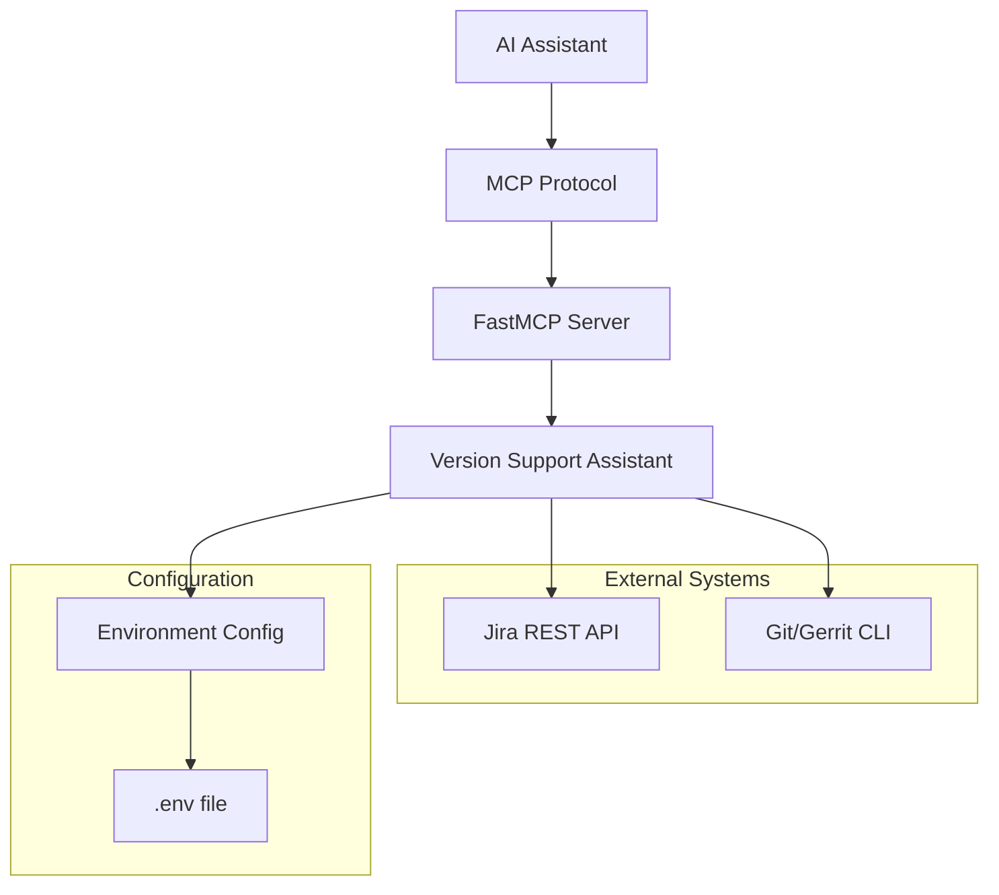

# Design Document

## Overview

The Version Support Assistant is implemented as an MCP (Model Context Protocol) tool using the FastMCP framework. It provides a set of async functions that interact with Jira REST APIs and Git/Gerrit systems to automate version support ticket workflows. The design follows a modular approach with clear separation between data models, API interactions, and business logic.

## Architecture

### High-Level Architecture



### Component Architecture

The system is organized into several key components:

1. **MCP Tool Layer**: FastMCP-decorated functions that serve as the public API
2. **Data Models**: Pydantic models for request/response validation
3. **API Client Layer**: HTTP client for Jira interactions
4. **Git Integration Layer**: Subprocess-based Git operations
5. **Configuration Layer**: Environment-based configuration management
6. **Utility Layer**: Helper functions for data processing

## Components and Interfaces

### Data Models

**Input Models:**
- `TicketFetchInput`: Parameters for fetching tickets (type, status, limit)
- `CommentInput`: Ticket ID and comment text for adding comments
- `StatusUpdateInput`: Ticket ID for status transitions
- `GerritPRInput`: Ticket ID, description, branch, and repo path for PR creation

**Output Models:**
- `TicketOutput`: Individual ticket data (ID, summary, status, assignee, created, releaseNotes)
- `TicketFetchOutput`: Collection of tickets
- `CommentOutput`: Success status and comment ID or error
- `StatusUpdateOutput`: Success status or error
- `GerritPROutput`: Success status, change ID, or error

### MCP Tool Interface

```python
@mcp.tool("ticket.fetch")
async def fetch_tickets(input: TicketFetchInput) -> TicketFetchOutput

@mcp.tool("ticket.comment") 
async def add_comment(input: CommentInput) -> CommentOutput

@mcp.tool("ticket.accepted")
async def accept_ticket(input: StatusUpdateInput) -> StatusUpdateOutput

@mcp.tool("gerrit.create_pr")
async def create_gerrit_pr(input: GerritPRInput) -> GerritPROutput
```

### Jira API Integration

**Authentication**: HTTP Basic Auth using username/token from environment variables
**Endpoints Used**:
- `GET /rest/api/3/search/jql` - Ticket search with JQL queries
- `POST /rest/api/3/issue/{id}/comment` - Add comments
- `POST /rest/api/3/issue/{id}/transitions` - Status transitions

**JQL Query Construction**: Dynamic JQL queries based on project, type, and status filters

### Git/Gerrit Integration

**Operations**:
- `git add .` - Stage all changes
- `git commit -m "{formatted_message}"` - Commit with structured message
- `git push origin HEAD:refs/for/{branch}%wip` - Push to Gerrit with WIP flag

**Commit Message Format**:
```
{ticket_id} : {description}

Task-Url: https://tasktop.atlassian.net/browse/{ticket_id}
```

## Data Models

### Core Data Structures

**Ticket Representation**:
```python
class TicketOutput(BaseModel):
    id: str                    # Jira ticket key (e.g., "CON-123")
    summary: str              # Ticket title
    status: str               # Current status name
    assignee: str | None      # Assignee display name or None
    created: str              # ISO timestamp
    releaseNotes: str | None  # Extracted URL or None
```

**API Response Patterns**:
- Success responses include relevant data and success=True
- Error responses include success=False and descriptive error messages
- Optional fields use None for missing data

### Data Processing Logic

**Release Notes Extraction**:
- Parses Jira's structured description format (nested content arrays)
- Searches for "Release Information:" marker
- Extracts first URL following the marker
- Handles both structured JSON and plain text descriptions

## Error Handling

### Error Categories

1. **Configuration Errors**: Missing environment variables
2. **Authentication Errors**: Invalid Jira credentials
3. **API Errors**: Jira API failures, network issues
4. **Git Errors**: Repository issues, push failures
5. **Data Processing Errors**: Invalid ticket descriptions, parsing failures

### Error Handling Strategy

**Graceful Degradation**:
- Missing release notes don't fail ticket fetching
- Individual ticket processing errors don't stop batch operations
- Clear error messages without exposing sensitive information

**Error Response Format**:
```python
{
    "success": false,
    "error": "Descriptive error message"
}
```

**Exception Handling Patterns**:
- Try-catch blocks around external API calls
- Subprocess error capture for Git operations
- Validation errors handled by Pydantic

## Testing Strategy

### Unit Testing Approach

**Mocking Strategy**:
- Mock HTTP clients for Jira API testing
- Mock subprocess calls for Git operations
- Use pytest fixtures for common test data

**Test Categories**:
1. **Data Model Tests**: Pydantic validation and serialization
2. **API Integration Tests**: Mocked Jira responses
3. **Business Logic Tests**: Release notes extraction, error handling
4. **End-to-End Tests**: Live API connections (optional, env-dependent)

### Test Structure

**Mock-based Tests**:
- Fast execution, no external dependencies
- Test error conditions and edge cases
- Validate request/response formats

**Integration Tests**:
- Optional live Jira connection testing
- Requires environment variables
- Skipped when credentials unavailable

**Test Data Management**:
- Realistic mock responses based on actual Jira API
- Edge cases: empty responses, malformed data
- Error scenarios: authentication failures, network issues

### Quality Assurance

**Code Quality Tools**:
- Black for code formatting
- Flake8 for linting
- Pytest for testing with async support

**Validation Approach**:
- Pydantic models ensure data integrity
- Type hints for static analysis
- Comprehensive error handling testing

## Security Considerations

### Credential Management

**Environment Variables**:
- Sensitive data stored in .env file
- No hardcoded credentials in source code
- Clear error messages when credentials missing

**Authentication Security**:
- HTTP Basic Auth over HTTPS for Jira
- Git authentication relies on existing configuration
- No credential logging or exposure in error messages

### Input Validation

**Pydantic Validation**:
- All inputs validated against schemas
- Type safety enforced
- Malicious input sanitization

**JQL Injection Prevention**:
- Parameterized queries where possible
- Input sanitization for dynamic query construction

## Performance Considerations

### Async Operations

**HTTP Client**:
- httpx AsyncClient for non-blocking API calls
- Connection pooling for multiple requests
- Proper resource cleanup with context managers

**Batch Processing**:
- Efficient ticket fetching with configurable limits
- Parallel processing potential for multiple operations

### Resource Management

**Memory Usage**:
- Streaming responses for large ticket sets
- Efficient data structures
- Proper cleanup of HTTP connections

**Rate Limiting**:
- Respect Jira API rate limits
- Configurable request limits
- Error handling for rate limit responses